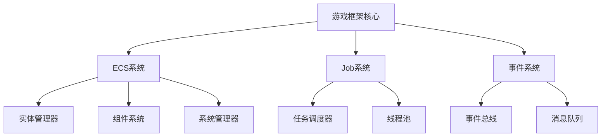
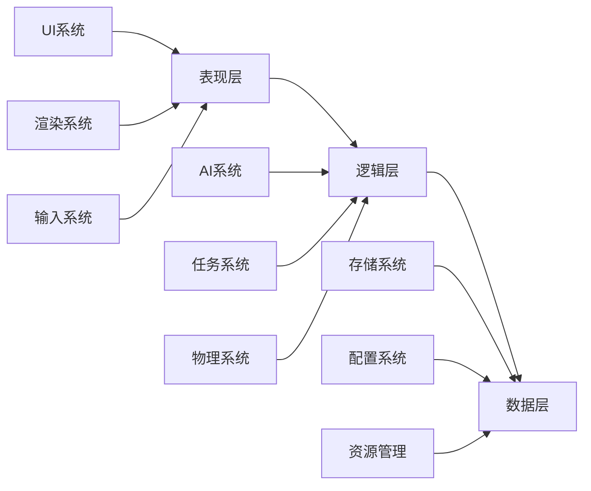
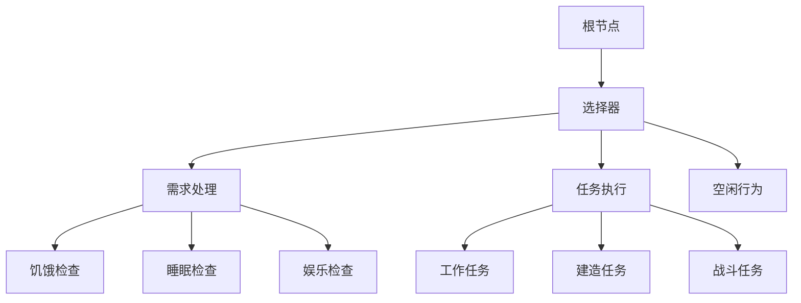
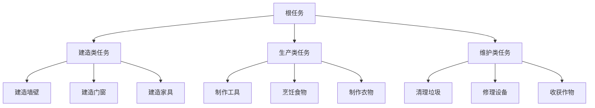
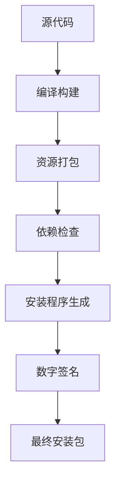
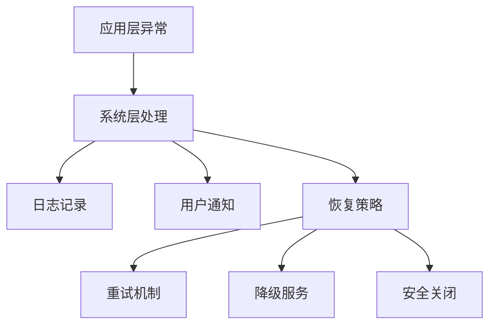

# 设计文档

## 概述

本设计文档描述了一个类似RimWorld的游戏框架，采用模块化架构设计，支持智能AI行为系统、层次化任务管理、程序化地图生成和可扩展的模组系统。框架将使用C#开发，支持跨平台部署，并提供完整的安装包解决方案。

## 架构

### 核心架构模式

框架采用Entity-Component-System (ECS) 架构模式，结合Job System实现高性能的多线程处理：



### 系统层次结构



## 组件和接口

### 1. 游戏框架核心 (GameFramework)

**主要接口：**
```csharp
public interface IGameFramework
{
    void Initialize(GameConfig config);
    void Update(float deltaTime);
    void Shutdown();
    T GetSystem<T>() where T : IGameSystem;
    void RegisterSystem<T>(T system) where T : IGameSystem;
}

public interface IGameSystem
{
    void Initialize();
    void Update(float deltaTime);
    void Shutdown();
    int Priority { get; }
}
```

**核心组件：**
- **SystemManager**: 管理所有游戏系统的生命周期
- **EventBus**: 处理系统间通信
- **ResourceManager**: 管理游戏资源加载和释放
- **ConfigManager**: 处理配置文件和设置

### 2. 人物系统 (CharacterSystem)

**行为树架构：**


**主要接口：**
```csharp
public interface ICharacterSystem : IGameSystem
{
    void RegisterCharacter(CharacterEntity character);
    void AssignTask(CharacterEntity character, ITask task);
    void UpdateBehavior(CharacterEntity character, float deltaTime);
}

public interface IBehaviorTree
{
    BehaviorResult Execute(CharacterContext context);
    void Reset();
}

public interface ICharacterAI
{
    void SetBehaviorTree(IBehaviorTree behaviorTree);
    void UpdateDecisionMaking(float deltaTime);
    TaskPriority CalculateTaskPriority(ITask task);
}
```

**核心组件：**
- **BehaviorTreeManager**: 管理所有角色的行为树
- **TaskAssigner**: 智能任务分配系统
- **PathfindingSystem**: A*路径寻找算法
- **SkillSystem**: 角色技能和属性管理

### 3. 任务树系统 (TaskTreeSystem)

**任务层次结构：**


**主要接口：**
```csharp
public interface ITaskTreeSystem : IGameSystem
{
    void CreateTask(TaskDefinition definition);
    void CompleteTask(TaskId taskId);
    IEnumerable<ITask> GetAvailableTasks();
    void SetTaskDependency(TaskId parent, TaskId child);
}

public interface ITask
{
    TaskId Id { get; }
    TaskType Type { get; }
    TaskPriority Priority { get; }
    TaskStatus Status { get; }
    IEnumerable<TaskId> Dependencies { get; }
    bool CanExecute(CharacterEntity character);
    TaskResult Execute(CharacterEntity character);
}
```

**核心组件：**
- **TaskManager**: 任务生命周期管理
- **DependencyResolver**: 任务依赖关系解析
- **TaskQueue**: 优先级任务队列
- **TaskValidator**: 任务有效性验证

### 4. 地图生成系统 (MapGenerationSystem)

**生成流程：**


**主要接口：**
```csharp
public interface IMapGenerator
{
    GameMap GenerateMap(MapGenerationConfig config);
    void SetSeed(int seed);
    bool ValidateMap(GameMap map);
}

public interface INoiseGenerator
{
    float[,] GenerateNoise(int width, int height, NoiseConfig config);
    float GetNoiseValue(float x, float y);
}

public interface ITerrainGenerator
{
    TerrainType[,] GenerateTerrain(float[,] heightMap, TerrainConfig config);
    void PlaceResources(GameMap map, ResourceConfig config);
}
```

**核心算法：**
- **Perlin噪声**: 基础地形高度图生成
- **细胞自动机**: 洞穴和复杂结构生成
- **泊松圆盘采样**: 资源点均匀分布
- **连通性算法**: 确保地图可达性

### 5. 安装包系统 (PackagingSystem)

**打包流程：**


**主要组件：**
- **BuildSystem**: 自动化构建流程
- **AssetBundler**: 游戏资源打包
- **InstallerGenerator**: 安装程序生成器
- **DependencyManager**: 依赖项管理

## 数据模型

### 核心实体模型

```csharp
// 角色实体
public class CharacterEntity : Entity
{
    public SkillSet Skills { get; set; }
    public NeedSystem Needs { get; set; }
    public InventoryComponent Inventory { get; set; }
    public PositionComponent Position { get; set; }
    public BehaviorComponent Behavior { get; set; }
}

// 任务数据模型
public class TaskData
{
    public TaskId Id { get; set; }
    public string Name { get; set; }
    public TaskType Type { get; set; }
    public TaskPriority Priority { get; set; }
    public Vector3 Location { get; set; }
    public Dictionary<string, object> Parameters { get; set; }
    public List<TaskId> Prerequisites { get; set; }
}

// 地图数据模型
public class MapData
{
    public int Width { get; set; }
    public int Height { get; set; }
    public TerrainType[,] Terrain { get; set; }
    public List<ResourceNode> Resources { get; set; }
    public List<Structure> Structures { get; set; }
    public PathfindingGrid NavigationGrid { get; set; }
}
```

### 配置数据模型

```csharp
public class GameConfig
{
    public GraphicsConfig Graphics { get; set; }
    public AudioConfig Audio { get; set; }
    public GameplayConfig Gameplay { get; set; }
    public ModConfig Mods { get; set; }
}

public class MapGenerationConfig
{
    public int Seed { get; set; }
    public Vector2Int Size { get; set; }
    public NoiseConfig[] NoiseLayers { get; set; }
    public BiomeConfig[] Biomes { get; set; }
    public ResourceDistributionConfig Resources { get; set; }
}
```

## 正确性属性

属性是应该在系统的所有有效执行中保持为真的特征或行为——本质上是关于系统应该做什么的正式陈述。属性作为人类可读规范和机器可验证正确性保证之间的桥梁。

基于需求分析，以下是关键的正确性属性：

### 属性 1: 错误处理和日志记录
*对于任何*系统错误情况，游戏框架应当记录错误信息并继续运行而不崩溃
**验证需求: 需求 1.4**

### 属性 2: 任务分配一致性
*对于任何*人物和任务组合，任务分配应当基于人物的技能水平和任务优先级进行合理匹配
**验证需求: 需求 2.1**

### 属性 3: 行动决策完整性
*对于任何*人物行动，决策过程应当考虑角色的当前技能、状态和环境因素
**验证需求: 需求 2.2**

### 属性 4: 协作冲突避免
*对于任何*需要多人协作的任务，系统应当协调分配以避免资源冲突和重复工作
**验证需求: 需求 2.3**

### 属性 5: 路径重规划
*对于任何*遇到障碍的移动请求，系统应当重新计算可行路径或提供替代方案
**验证需求: 需求 2.4**

### 属性 6: 状态更新一致性
*对于任何*完成的任务，相关角色的状态和经验值应当根据任务类型和完成质量进行正确更新
**验证需求: 需求 2.5**

### 属性 7: 任务依赖管理
*对于任何*新创建的任务，其依赖关系应当被正确设置并在任务树中维护
**验证需求: 需求 3.1**

### 属性 8: 任务状态传播
*对于任何*任务状态变化，所有依赖该任务的其他任务的可用性应当自动更新
**验证需求: 需求 3.2**

### 属性 9: 任务激活链
*对于任何*完成的任务，其后续依赖任务应当在满足所有前置条件时自动激活
**验证需求: 需求 3.4**

### 属性 10: 任务状态持久化往返
*对于任何*有效的任务树状态，保存然后加载应当产生等价的任务树状态
**验证需求: 需求 3.5**

### 属性 11: 地图地形多样性
*对于任何*生成的地图，应当包含至少3种不同类型的地形，且每种地形占总面积的5%-60%
**验证需求: 需求 4.1**

### 属性 12: 资源分布合理性
*对于任何*生成的地图，资源点之间的最小距离应当大于指定阈值，确保合理分布
**验证需求: 需求 4.3**

### 属性 13: 地图连通性验证
*对于任何*生成的地图，所有可行走区域应当相互连通，不存在孤立的可达区域
**验证需求: 需求 4.5**

### 属性 14: 安装包完整性
*对于任何*生成的安装包，应当包含所有必需的游戏文件、依赖库和配置文件
**验证需求: 需求 5.1**

### 属性 15: 安装后系统配置
*对于任何*成功的安装过程，应当在目标系统中创建正确的快捷方式、注册表项和文件关联
**验证需求: 需求 5.3**

### 属性 16: 卸载完整性
*对于任何*卸载操作，应当完全移除所有游戏相关文件、注册表项和系统配置
**验证需求: 需求 5.4**

### 属性 17: 跨平台安装适配
*对于任何*支持的操作系统平台，安装包应当正确适配该平台的文件系统和系统要求
**验证需求: 需求 5.5**

### 属性 18: 游戏状态保存压缩
*对于任何*游戏状态保存操作，保存文件应当使用压缩格式且大小应当小于未压缩版本
**验证需求: 需求 6.4**

### 属性 19: 资源不足时的降级处理
*对于任何*系统资源不足的情况，游戏应当自动降低图形质量或暂停非关键功能而不崩溃
**验证需求: 需求 6.5**

### 属性 20: 模组加载安全性
*对于任何*模组文件，加载过程应当验证其安全性并在检测到恶意代码时拒绝加载
**验证需求: 需求 7.1**

### 属性 21: 模组热重载
*对于任何*已加载的模组，修改其内容后应当能够在不重启游戏的情况下重新加载
**验证需求: 需求 7.2**

### 属性 22: 模组冲突检测
*对于任何*多个模组的组合，系统应当检测潜在冲突并提供解决建议或自动解决方案
**验证需求: 需求 7.3**

### 属性 23: 模组错误隔离
*对于任何*模组运行时错误，核心游戏应当继续正常运行，错误应当被隔离在模组范围内
**验证需求: 需求 7.5**

### 属性 24: 配置验证
*对于任何*配置文件修改，系统应当验证配置的有效性并在发现错误时提供具体的错误信息
**验证需求: 需求 8.1**

### 属性 25: 配置加载完整性
*对于任何*游戏启动，所有配置设置应当从配置文件正确加载并应用到相应的游戏系统
**验证需求: 需求 8.2**

### 属性 26: 游戏数据序列化往返
*对于任何*有效的游戏状态，序列化然后反序列化应当产生等价的游戏状态
**验证需求: 需求 8.3**

### 属性 27: 数据版本兼容性
*对于任何*旧版本的游戏数据文件，系统应当能够正确读取并迁移到当前版本格式
**验证需求: 需求 8.4**

### 属性 28: 动态配置更新
*对于任何*运行时配置变更，新配置应当在不重启游戏的情况下生效并影响相关系统行为
**验证需求: 需求 8.5**

## 错误处理

### 异常处理策略

**分层错误处理：**


**核心错误类型：**
- **SystemException**: 系统级错误，需要记录并尝试恢复
- **GameLogicException**: 游戏逻辑错误，记录并继续运行
- **ResourceException**: 资源加载错误，提供默认资源
- **NetworkException**: 网络错误，启用离线模式
- **ModException**: 模组错误，隔离并禁用问题模组

### 错误恢复机制

**自动恢复策略：**
1. **重试机制**: 对于临时性错误，实施指数退避重试
2. **降级服务**: 在资源不足时自动降低服务质量
3. **状态回滚**: 在关键操作失败时回滚到上一个稳定状态
4. **安全模式**: 在严重错误时启动最小功能集合

**错误监控和报告：**
- 实时错误监控和统计
- 自动错误报告生成
- 性能影响分析
- 用户友好的错误提示

## 测试策略

### 双重测试方法

本框架采用单元测试和基于属性的测试相结合的综合测试策略：

**单元测试：**
- 验证特定示例、边界情况和错误条件
- 测试组件间的集成点
- 验证具体的业务逻辑实现
- 快速反馈和回归测试

**基于属性的测试：**
- 验证跨所有输入的通用属性
- 通过随机化实现全面的输入覆盖
- 测试系统的不变量和约束条件
- 发现边界情况和意外行为

### 测试框架配置

**基于属性的测试库：** NUnit + FsCheck.NUnit (C#)
**测试配置：**
- 每个属性测试最少100次迭代
- 每个属性测试必须引用其设计文档属性
- 标签格式：**Feature: rimworld-game-framework, Property {number}: {property_text}**

**测试覆盖范围：**
- **核心系统测试**: ECS架构、Job系统、事件系统
- **AI行为测试**: 行为树执行、任务分配、路径寻找
- **地图生成测试**: 噪声生成、地形分布、连通性验证
- **数据持久化测试**: 序列化往返、版本兼容性
- **模组系统测试**: 加载安全性、冲突检测、错误隔离
- **性能测试**: 内存使用、帧率稳定性、资源管理

### 测试数据生成

**智能生成器设计：**
- **角色生成器**: 生成具有随机技能和属性的角色
- **任务生成器**: 创建具有复杂依赖关系的任务网络
- **地图生成器**: 生成各种大小和复杂度的测试地图
- **配置生成器**: 生成有效和无效的配置组合
- **模组生成器**: 创建测试用的模组文件和冲突场景

**约束智能化：**
- 生成器应当智能地约束到有效的输入空间
- 避免生成明显无效或无意义的测试数据
- 确保生成的数据能够有效测试目标属性
- 平衡随机性和测试覆盖的有效性